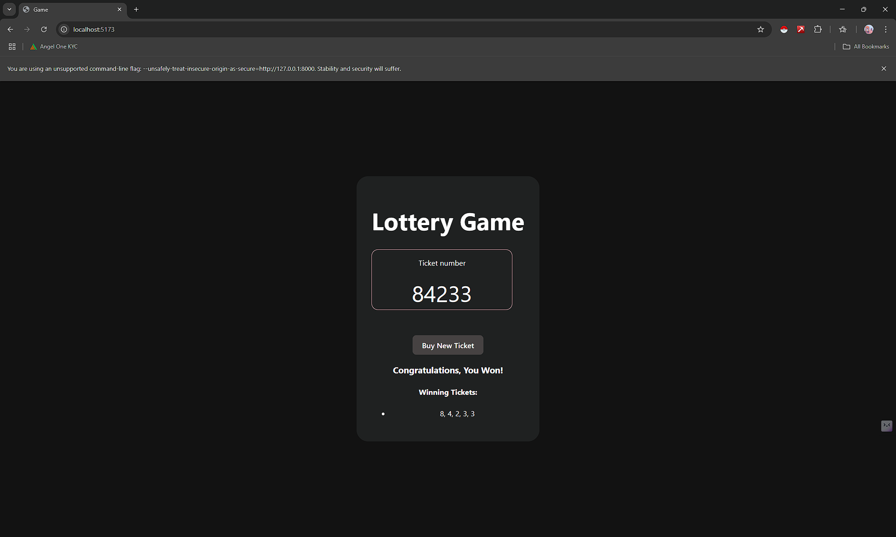
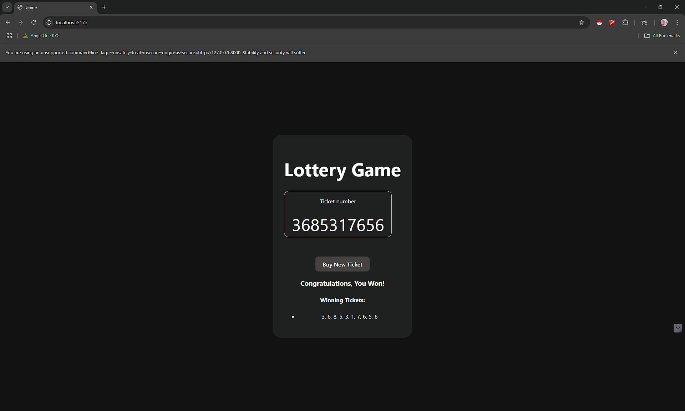

# 🎲 Dynamic Lottery Game - React App
A fun and customizable Lottery Game built with React! Buy a ticket and try your luck — if the sum of the numbers matches the winning sum, you win! 🎉

## 🚀 Features
- ✅ Dynamic ticket size (`n`): You decide how many numbers your ticket will have!
- ✅ Custom winning condition (`winningSum`): Set your own lucky sum!
- ✅ Generates random tickets every time
- ✅ Checks for winning tickets automatically
- ✅ Stores and displays all winning tickets
- ✅ Clean, modular code (separate `Ticket` component)
- ✅ Simple, responsive UI

## 🛠️ How to Customize
You can easily change:
- Number of ticket numbers (`n`)
- Target winning sum (`winningSum`)
Just update the props in `App.js`:

```javascript
function App() {
  return (
    <>
      <Lottery n={5} winningSum={20} />
    </>
  );
}

function App() {
  return (
    <>
      <Lottery n={10} winningSum={50} />
    </>
  );
}


```




## 📂 Folder Structure
├── public/
│   └── index.html
├── src/
│   ├── App.js
│   ├── Lottery.js
│   ├── Ticket.js
│   ├── helper.js
│   ├── App.css
│   └── index.js
├── README.md
└── package.json

## ⚙️ How to Run the Project Locally
1.Clone the repository:
git clone https://github.com/pradeepkumar823/lottery-Game01.git

2.Navigate into the project directory:
cd lottery-Game01

3.Install the dependencies:
npm install

Start the development server:
npm start

📖 How the Game Works
genRandomNumber(n): generates an array of n random numbers
sum(ticket): calculates the sum of numbers in a ticket
If the sum matches the winningSum, it's a Winning Ticket
Winning tickets are saved and displayed separately


git clone https://github.com/pradeepkumar823/lottery-Game01.git
